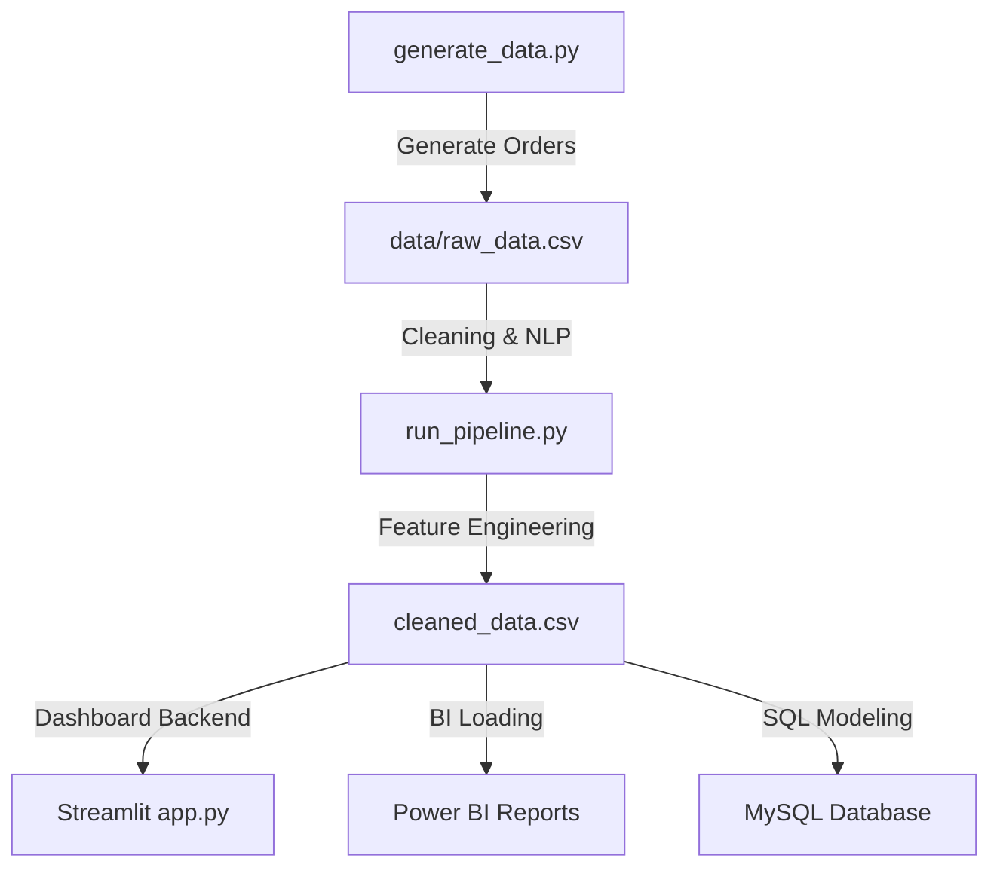

# 🍔 Food Delivery Operations & Customer Insights System

<div align="center">


<br><br>


<br><br>

[](https://swiggy-zomato-food-delivery-analysis-azsxnftnagslnvuvfhurr5.streamlit.app/)


<br><br>


<br><br>

## 📡 Swiggy & Zomato Operations Intelligence Console

### ⚡ Real-Time Operational Analytics • NLP Mining • Predictive Dispatch Intelligence

</div>

---


# 🌌 Executive Overview

<div align="center">

> A futuristic AI-powered operational intelligence system inspired by real-world architectures used by **Swiggy** and **Zomato**.

</div>

This project simulates a full-scale commercial food delivery ecosystem featuring:

- ⚡ 5,000+ dynamically generated transactional orders
- 🧠 NLP-powered customer sentiment intelligence
- 📊 Power BI & Streamlit analytics dashboards
- 📍 Geospatial operational heatmaps
- 🚚 Live delivery dispatch simulation
- 🏢 Dual-model relational MySQL architectures
- 📈 AI-style ETA prediction pipelines
- 🌙 Cyberpunk neon analytics UI

The system transforms raw operational records into high-performance business intelligence dashboards with real-time analytical experiences.

---


# ⚡ Core Features

<div align="center">

| 🚀 Analytics Engine | 🧠 AI/NLP Intelligence | 📊 Dashboard Systems |
|-------------------|-----------------------|---------------------|
| 5,000+ order simulation | Sentiment polarity analysis | Interactive Streamlit dashboards |
| Automated anomaly cleaning | Stopword purification | Plotly geospatial maps |
| Dynamic feature engineering | Review subjectivity scoring | Power BI executive reporting |
| Relational schema generation | Frequency mining pipelines | Real-time KPI consoles |

</div>

---

## 🌌 AI Operational Console

- ⚡ Live operational dispatch simulation
- 📈 Real-time KPI calculations
- 🌙 Neon cyberpunk dashboard aesthetics
- 📍 Delivery route intelligence
- 🚚 Dynamic ETA predictions
- 🔥 Interactive business metrics

---

## 🧠 NLP Customer Intelligence

- 📖 Sentiment polarity scoring
- 🧹 Stopword cleaning pipelines
- ☁️ Word cloud generation
- 🧠 Subjectivity analysis
- 📊 Review frequency analysis
- 💬 Consumer feedback intelligence

---

## 💼 Enterprise BI Reporting

- 📈 Power BI style executive dashboards
- 📊 Interactive analytical drilldowns
- 📌 Regional segmentation intelligence
- 💹 Revenue & cancellation insights
- 🏢 Corporate operational reporting

---


# 🛠️ Futuristic Tech Stack

<div align="center">


</div>

---


# 📈 Data Pipeline & System Workflow



---


# 📂 Repository Architecture

```text
food-delivery-analysis/
├── data/                       # Ingested and preprocessed transactional CSV tables
├── notebooks/                  # Interactive cleaning & NLP sentiment notebooks
├── sql/                        # Relational table DDL schemas and BI query scripts
├── dashboard/                  # Multi-sheet Streamlit app console and Power BI DAX manual
├── presentation/               # Slide-by-slide business performance executive blueprint
├── requirements.txt            # System environment package dependencies
└── README.md                   # Dynamic visual presentation handbook
```

---


# ⚙️ Local Setup Guide

### 1️⃣ Clone Repository
```bash
git clone https://github.com/Shivam09xc/Swiggy-Zomato-Food-Delivery-Analysis.git
cd Swiggy-Zomato-Food-Delivery-Analysis
```

### 2️⃣ Create Virtual Environment
```bash
python -m venv venv
```

### 🔓 Activate Environment
* **Windows PowerShell**:
  ```powershell
  venv\Scripts\activate
  ```
* **Mac/Linux**:
  ```bash
  source venv/bin/activate
  ```

### 3️⃣ Install Dependencies
```bash
pip install -r requirements.txt
```

### 4️⃣ Run Processing Pipelines
```bash
python scripts/generate_data.py
python scripts/run_pipeline.py
```

### 5️⃣ Launch Streamlit Dashboard
```bash
python -m streamlit run dashboard/app.py
```

---


# 📊 Business Insights Intelligence

### 🍕 Pizza & Biryani Dominate Revenue
* Generate **~58% of overall business revenue**
* Highest Average Order Value profile (**₹350 - ₹420**)
* Strongest customer retention and loyalty categories

### 🌃 Dinner Rush Peaks Between 7 PM – 10 PM
* Highest transactional order spikes of the day
* Single busiest business hour: **8 PM - 9 PM (~28%)**
* Major operational traffic and dispatch stress zone

### 🚚 Delayed Deliveries Destroy Ratings
* Customer ratings collapse strictly after a **40-minute threshold** (Averages drop to **★ 2.45**)
* Negative NLP review sentiment keywords spike dramatically (*"cold food"*, *"lukewarm"*)
* Strong operational rating penalty correlation score detected (**-0.6347**)

### 🌧️ Weekend Cancellation Surges
* Weekend order cancellations are **2.2x higher** than weekdays
* Triggered by heavy weekend traffic and stormy rain rider shortages (25%)
* Inherent kitchen overload prep-time checkout timeouts identified (40%)

### 📍 Geographic Weak Zones
* **Whitefield (~47 minutes)** & **Marathahalli (~44 minutes)** consistently underperform
* Severe road congestion bottlenecks and delivery rider deficits detected in heatmaps
* *Logistics Solution*: Reallocate 15% of underutilized Jayanagar fleet to Whitefield using surge bonuses

---


# 📊 Power BI Calculated DAX

```dax
Total Orders = COUNT(cleaned_data[order_id])

Total Revenue = SUM(cleaned_data[order_value])

Avg Delivery Time = 
CALCULATE(
    AVERAGE(cleaned_data[delivery_time]),
    cleaned_data[order_status] = "Delivered"
)

Cancellation Rate % = 
DIVIDE(
    CALCULATE([Total Orders], 
    cleaned_data[order_status] = "Cancelled"),
    [Total Orders],
    0
) * 100
```

---


# 🐍 Contribution Snake

<div align="center">
  
</div>

---


# 📈 GitHub Analytics

<div align="center">
  
  
  
  <br><br>
  
  
</div>

---


# 🔮 Future Enhancements

* 🤖 AI-Based Dynamic ETA Prediction Engine using Machine Learning
* 🛰️ Live Real-Time GPS Rider Routing & Tracking integrations
* ☁️ Multi-Node Cloud Database and Warehouse integration
* 📱 Consumer & Courier Mobile Operations Consoles
* 🔔 Smart Push Alerts & SMS Slack notifications
* 🧠 Deep Learning recommendation models on ordering behaviors
* 🌍 Multi-City Delivery and Weather congestion simulations
* 🛡️ Enterprise OAuth Authentication and Secure Slices Layers

---

<div align="center">

💙 Crafted with Passion by Shivam Soni

<br>


<br><br>

⭐ If you like this project, support it with a star!

<br>


</div>
