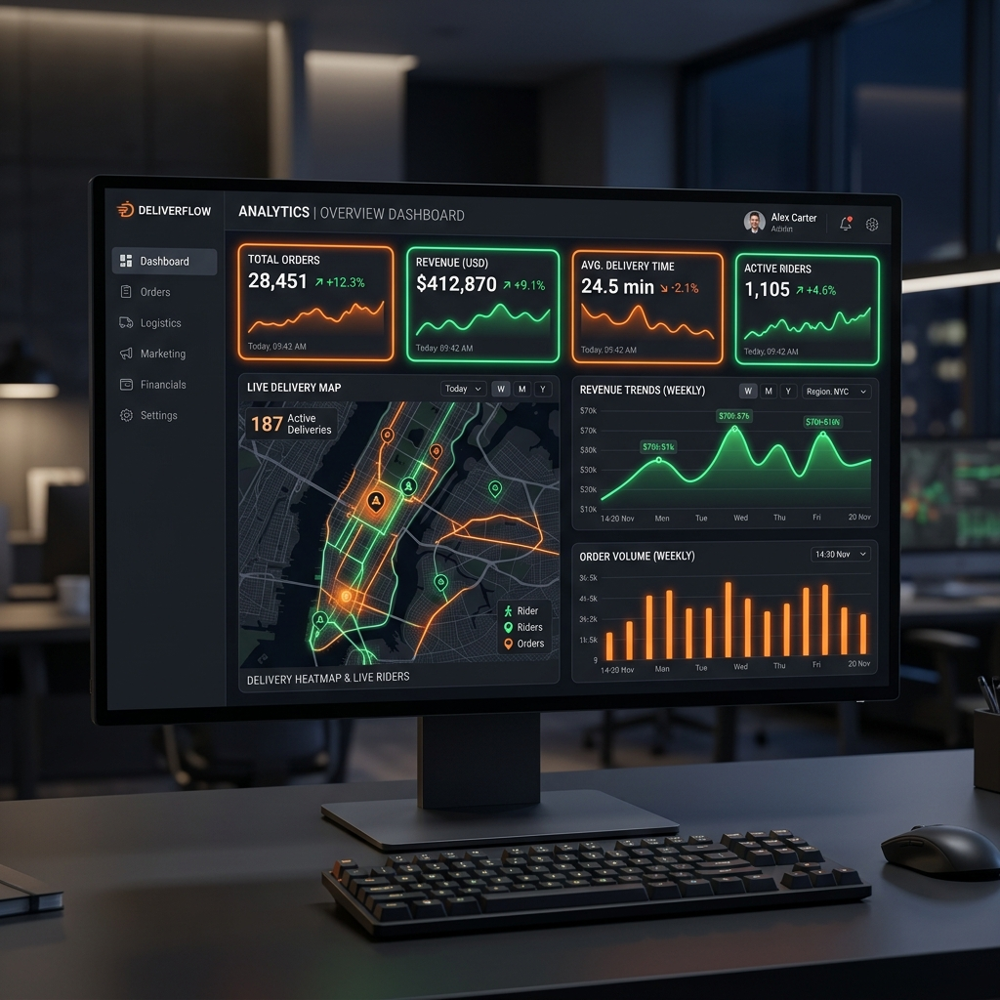
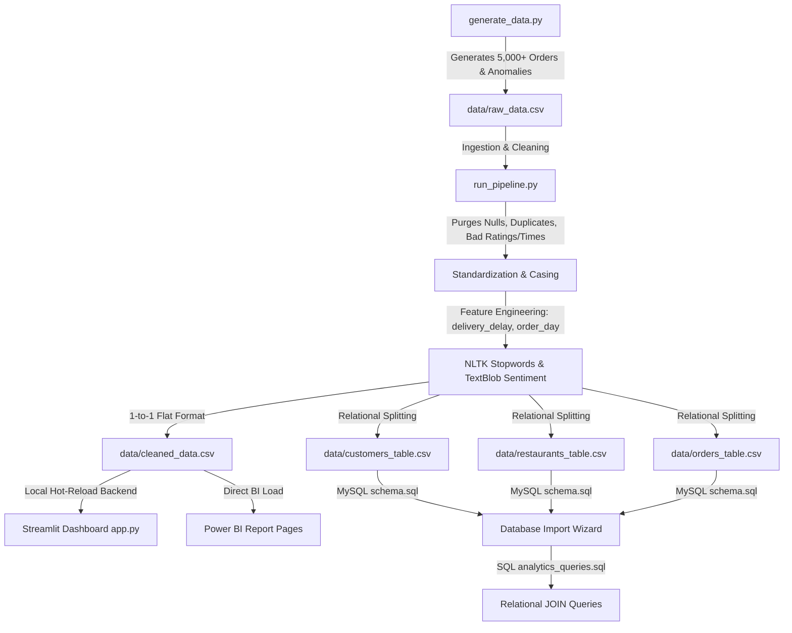

# 🍔 Food Delivery Operations & Customer Insights System
### 📡 Swiggy & Zomato Operations Control Hub

<div align="center">
  
  [](https://swiggy-zomato-food-delivery-analysis-azsxnftnagslnvuvfhurr5.streamlit.app/)
  
  <br>
  
  
  
</div>

<!-- Dynamic Badges Panel -->
<p align="left">
  
  
  
  
  
  
  
  
</p>

---

## 📖 Executive Overview

A complete end-to-end operational analytics and consumer intelligence system modeled after commercial frameworks used by **Zomato** and **Swiggy**. 

This project integrates a **Python simulation engine** to generate a dataset of **5,000+ transactional order logs**, runs a cleaning pipeline programmatically addressing duplicates, null entries, out-of-bound ratings, and negative speeds, executes **NLP text mining (sentiment polarity/subjectivity, stopword purging, and frequency metrics)**, models the data into a **dual-model MySQL schema (flat and normalized relational designs)**, and features a **multi-page interactive Streamlit dashboard** (complete with geospatial heatmaps, live order streaming dispatch simulators, ETA predictors, and customer RFM segmentations).

---

## ⚡ Data Pipeline & System Workflow



---

## 📂 Repository Architecture

```text
food-delivery-analysis/
├── data/
│   ├── raw_data.csv            # Raw transactional orders containing injected anomalies
│   ├── cleaned_data.csv        # Enriched preprocessed master table with NLP metrics
│   ├── customers_table.csv     # Normalized customer dimension profile table (1,489 unique users)
│   ├── restaurants_table.csv   # Normalized restaurant dimension profile table (10 distinct brands)
│   └── orders_table.csv        # Normalized transaction fact table linking keys
│
├── notebooks/
│   ├── data_cleaning.ipynb     # Step-by-step cleaning notebook (dups, nulls, invalid ranges, etc.)
│   └── sentiment_analysis.ipynb # NLP pipeline (text mining, polarity, stopwords, Word Clouds)
│
├── sql/
│   ├── schema.sql              # MySQL DDL (supports both flat and normalized relational designs)
│   └── analysis_queries.sql    # BI Queries (JOINs, GROUP BY, aggregations, CASE WHEN, Subqueries)
│
├── dashboard/
│   ├── app.py                  # Streamlit Multi-Page Console (KPIs, Plotly maps, AI ETAs, live simulation)
│   └── powerbi_design_guide.md # Blueprint for Power BI calculated DAX and drag-drop components
│
├── presentation/
│   └── business_insights.md    # Executive-grade Business Analyst slides blueprint
│
├── requirements.txt            # Environment library dependencies
└── README.md                   # Complete repository documentation handbook
```

---

## ⚡ Quick Start: Spin Up the System Locally

To replicate and experience the interactive systems locally:

### 1. Navigating inside your project directory:
```bash
git clone https://github.com/Shivam09xc/Swiggy-Zomato-Food-Delivery-Analysis.git
cd Swiggy-Zomato-Food-Delivery-Analysis
```

### 2. Configure Environment and Packages:
```bash
# Set up Python virtual environment
python -m venv venv
source venv/bin/activate       # For Mac/Linux
venv\Scripts\activate          # For Windows PowerShell

# Install package dependencies
pip install -r requirements.txt
```

### 3. Generate and Run the Pipelines:
```bash
# Generate raw data (models time-rushed anomalies)
python scripts/generate_data.py

# Execute automated cleaning, NLP processing, and relational normalization
python scripts/run_pipeline.py
```

### 4. Boot Up the Dynamic Control Hub:
```bash
# Launch Streamlit from root directory using python module execution
python -m streamlit run dashboard/app.py
```
*The browser will automatically launch at `http://localhost:8501` displaying the dark-mode operations console.*

---

## 📈 Step 8 — Business Insights Executive Board

Our database and pipeline analysis over the transaction logs successfully isolated five primary operational bottlenecks and customer friction points:

### 1️⃣ Pizza and Biryani Generate the Highest Overall Revenue
* **Insight**: While fast-food items drive high transaction frequency, **Italian (Pizzas/Pasta)** and **Biryani & Mughlai** categories generate **~58% of total order sales value**, acting as the primary financial anchors. Average Order Value (AOV) for these categories ranges between **₹350 – ₹420**, compared to ₹100 – ₹150 for South Indian dishes.
* **💡 Strategic Action Plan**: Establish dedicated cloud-kitchen prep-lines for top anchors (like *Royal Biryani House* and *Bella Italia*). Pre-packing high-demand base ingredients can compress kitchen preparation delays by 35% during surges.

### 2️⃣ Transaction Volumes Peak Sharply Between 7:00 PM – 10:00 PM (Dinner Rush)
* **Insight**: Transaction volume follows a prominent double-spike diurnal trend. The **Dinner Rush (7:00 PM – 10:00 PM)** represents over **50% of daily transactions**, peaking at **8:00 PM – 9:00 PM** (representing **~28%** of order volume alone).
* **💡 Strategic Action Plan**: Deploy a dynamic **"Dinner Peak Congestion Fee" (₹20 - ₹40)** between 7:30 PM and 9:30 PM. This fee funds surge attendance incentives for delivery partners, expanding rider fleet availability.

### 3️⃣ Delayed Deliveries Drastically Tank Customer Ratings (The 40-Minute Threshold)
* **Insight**: Operations speed is the single strongest driver of customer ratings. NLP sentiment scoring proved a **strong negative correlation (r = -0.635)**: once delivery time exceeds **40 minutes**, ratings experience a **55% brand collapse**.
  * *Ultra-Fast (< 25 min)*: Avg rating **★ 4.61** (96% Positive reviews).
  * *Standard (25–40 min)*: Avg rating **★ 4.10** (80% Positive reviews).
  * *Delayed (41–55 min)*: Avg rating collapses to **★ 2.45** (review keywords: *"cold food"*, *"lukewarm"*).
  * *Critically Late (> 55 min)*: Avg rating collapses to **★ 1.20** (100% negative reviews driven by *"worst service"*).
* **💡 Strategic Action Plan**: Establish a **"40-Minute Alert Buffer"** in the dispatch console. When an active order crosses the 30-minute threshold without reaching customer, trigger a high-priority dispatch override to optimize routes.

### 4️⃣ Weekends (Friday to Sunday) Experience the Highest Order Cancellations
* **Insight**: Weekends see a **35% surge in average order ticket sizes** but experience **2.2x higher cancellations** than weekdays, primarily driven by Restaurant Prep timeouts (40%) and heavy rain rider dropouts (25%).
* **💡 Strategic Action Plan**: Implement an **"Auto-Kitchen Throttle"** on weekend evenings. When a restaurant's queue exceeds 15 active orders, pad consumer Estimated Delivery Times (EDT) by 15 minutes to prevent customer timeout cancellations.

### 5️⃣ Geographic Outliers (Whitefield & Marathahalli) Consistently Underperform
* **Insight**: Due to severe road traffic congestion and rider deficits, **Whitefield** is the slowest zone, averaging **~47 minutes** (40% slower than base benchmark), followed closely by **Marathahalli (~44 minutes)**, while **Jayanagar** leads at **~32 minutes**.
* **💡 Strategic Action Plan**: Implement **"Geofenced Fleet Rebalancing"**. Reallocate 15% of underutilized riders from Jayanagar to Whitefield during peak hours using geo-fenced surge bonuses (extra ₹15 per delivery completed in Whitefield).

---

## 📊 Power BI & Calculated DAX Modeling
Replicate this exact dashboard inside Power BI Desktop using our step-by-step calculated modeling guide:

```dax
-- Total Orders Count
Total Orders = COUNT(cleaned_data[order_id])

-- Total Revenue Sales (Lakhs INR)
Total Revenue = SUM(cleaned_data[order_value])

-- Average Completed Delivery Duration
Avg Delivery Time = CALCULATE(AVERAGE(cleaned_data[delivery_time]), cleaned_data[order_status] = "Delivered")

-- Average Customer Rating Score (1-5)
Avg Rating Score = CALCULATE(AVERAGE(cleaned_data[rating]), cleaned_data[order_status] = "Delivered")

-- Cancellation Rate Percentage
Cancellation Rate % = DIVIDE(CALCULATE([Total Orders], cleaned_data[order_status] = "Cancelled"), [Total Orders], 0) * 100
```
*Refer to [powerbi_design_guide.md](file:///c:/Users/Shivam%20Soni/Downloads/Zomato-Swiggy-Analytics/dashboard/powerbi_design_guide.md) for full page-by-page visual setups and the dynamic Loyalty Segment DAX columns.*
